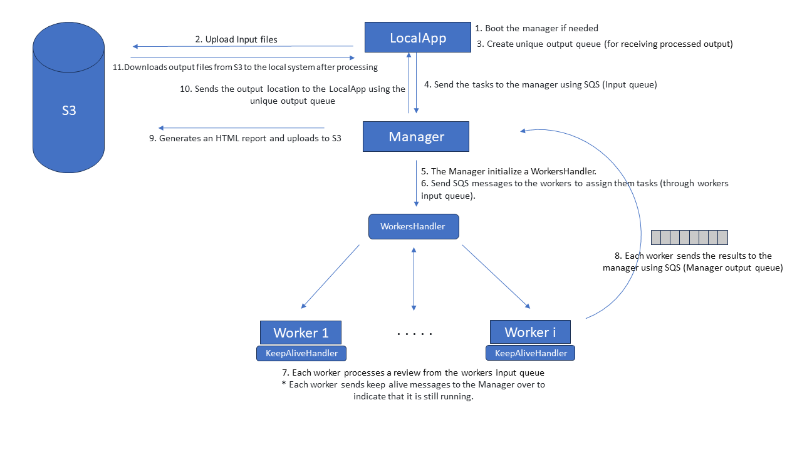

# Distributed System Programming Assignment 1

### Requirements:
1. Linux\WSL (to run build.sh)
2. AWS client installed and credentials configured
3. Docker
4. Java JRE 21

### How to run the program:
1. Set the working directory to the root of the project.
2. Run the script build.sh to build the docker image and push it to the AWS ECR. 
The script will create the ECR repository if it doesn't exist. The source files will be copied to the docker image and
compiled there using maven. The container will be used for both the Manager and the Worker, the role will be determined
using an environment variable.
3. Compile the application locally using maven and run it using the following command:
```
java -jar local/target/local-1.0.jar inputFileName1... inputFileNameN outputFileName1... outputFileNameN n [-t]
```
Where inputFileName1... inputFileNameN are the input files, outputFileName1... outputFileNameN are the output files, 
n is the reviews per worker ratio and -t is an optional flag to terminate the Manager in the end of the execution.

This is it! No need to create a custom AMI or to install any dependencies on the EC2 instances. The docker image will be
used to run the application on the EC2 instances. We use an EKS AMI with docker pre-installed. 
The default IAM role and security group of the lab is used for the EC2 instances.

## Code Design

The project is split into 4 sub-modules:

### Common
This module contains the shared classes between the LocalApp, the Manager and the Worker. 
It contains protocol classes, which define the structure of the messages sent between the components using SQS.
It also contains a generic consumer implementation, which is used by other modules to consume messages from sqs.
- The consumer receives messages from a single SQS queue and distributes them to the registered processors. 
- The processors are executed through a thread pool, which is created by the consumer. 
- The consumer runs an additional thread to extend the visibility timeout of the messages as long as they are set to be processed. 
It supports a limit to the time the message visibility can be extended.
- The consumer supports limiting the number of in-flight messages and the number of threads in the pool.
- The consumer also implements a shutdown method, which will gracefully shut down the thread pool and the consumer itself.

### LocalApp
This module contains the main class of the LocalApp. The LocalApp will first boot the Manager if it isn't running. 
It is responsible for uploading the input files to S3 and sending the tasks to the Manager using SQS. 
Each input files is assigned a random UUID, which is used to track the progress of the task.
The LocalApp creates a new queue for each run that will be used to receive an indication the processing of its input file
are completed by the Manager and the worker. The LocalApp will then download the output files from S3 and save them to the
local file system. The LocalApp will also send a termination message the Manager if the -t flag is provided.

### Manager
This module contains the main class of the Manager. The Manager is responsible for managing the workers and the tasks.
It has 2 consumer instances used in its main class:
1. A consumer for the LocalApp queue, which is used to receive the tasks from the LocalApp.
2. A consumer for the Worker queue, which is used to receive the results from the Workers.

The Manager will also send SQS messages to the Workers to assign them tasks and send a message to the LocalApp queue to indicate
the completion of the task.

The Manager will run the WorkersHandler in a separate thread. The WorkersHandler is responsible for creating and terminating
the workers:
- It maintains a list of the workers and their status. 
- Dynamically scales the number of workers based on the number of tasks in the queue and the number of workers that are currently running. 
- Uses a dedicated SQS queue to receive keep alive from the workers, if it doesn't receive a keep alive message from a worker 
for a certain period of time, it will terminate the worker and remove it from the list of workers. It will replace the
terminated worker with a new one if necessary. 
- Terminates the workers if the Manager is terminated. Workers termination is done by simply 
terminating the EC2 instance using the AWS SDK. 

The Manager will create the HTML report and upload it to S3 once all tasks of an input file are completed. 
The report will be uploaded to an S3 bucket and the LocalApp will be able to download it.

### Worker
This module contains the main class of the Worker. The Worker is responsible for processing the tasks.
It has a consumer instance used in its main class to receive the tasks from the Manager over an SQS queue.
The Worker will process the tasks and send the results to the Manager using another SQS queue.
Through the generic implementation of the consumer, the Worker will be able to process multiple tasks in parallel.
It will also send keep alive messages to the Manager over a different thread to indicate that it is still running.

## Scaling

Our implementation is designed to be scalable. 
- The Manager will dynamically scale the number of workers based on the number of tasks in the queue and the number of workers that are currently running.
- SQS messages are sent in batches where possible to reduce the number of messages sent and the cost of the messages. 
It also helps overcome network latency by reducing round trips.
- Input files are processed in parallel. The entire file is not read into memory at once, but rather read in chunks.
- The Manager doesn't hold all the reviews data in memory after sending them to the workers, but only the identifiers of the reviews. 


## Persistence

- The Workers are stateless and can be terminated and replaced at any time. 
- We have implemented two mechanisms to handle workers node failures and stalling:
  1. The WorkersHandler in the Manager will terminate the workers if it doesn't receive a keep alive message from a worker for a certain period of time. 
  2. There is a limit to the number of time a message visibility can be extended. If the worker fails to process the message, it will be returned to the queue and another worker will process it. 
  this value can be configured in the application.properties file. 
- The application is designed for network failures and message loss. Messages will only be deleted from queue after they are successfully processed.

## Threads and Concurrency

- The consumer uses a thread pool to process the tasks. The number of threads in the pool can be configured in the application.properties file.
- The consumer runs an additional thread to extend the visibility timeout of the messages as long as they are set to be processed.
- Message processing in parallel is handled by the consumer using the thread pool. 
- The WorkersHandler in the Manager runs in a separate thread and is responsible for creating and terminating the workers as well as receiving keep alive messages.
- The worker uses an additional thread to send keep alive messages to the Manager.
- Concurrency is mostly handled by using ConcurrentHashMaps across the implementation. 
- A Semaphore is used to limit the number of in-flight messages in the consumer.

## Termination

- The generic consumer supports a shutdown method. The shutdown method will gracefully shut down the thread pool and the consumer itself.
Gracefully shutting down the thread pool will result in the completion of the tasks that are currently being processed without accepting new tasks.
Once all the tasks are completed, the consumer thread will exit.
- The Manager will terminate the workers if it is terminated. Workers termination is done by simply terminating the EC2 instance using the AWS SDK.
- If a LocalApp sends a termination message to the Manager, it will invoke the shutdown on the tasks input consumer, 
which will prevent the Manager from accepting new tasks. Once all the tasks are completed, the Manager will terminate the workers and exit.

## Testing and running results

- We have tested the system over the aws environment with different input files, different number of workers and multiple
LocalApp instances running at the same time.
- In out testing we have used ARM instances with 2 vCPUs and 8GB of memory (t4g.large) for the workers. ARM instances are
cheaper than x86 instances for the same amount of memory. Each worker was running 2 threads to process the tasks.
- A complete run with all 5 provided input files and 8 workers takes approximately 16 minutes.

## System Diagram


